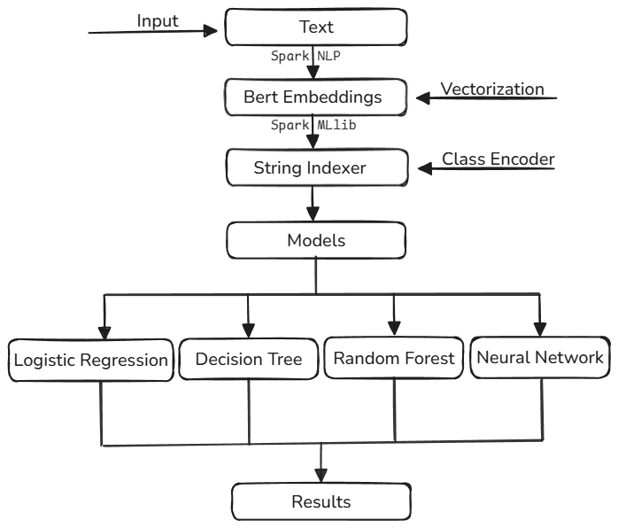

# Leveraging Spark NLP and MLlib for Big Data Text Analysis

## Group Members

| Name         | Email                       |
|--------------|-----------------------------|
| Madhan S     | 22bds036@iiitdwd.ac.in      |
| Bharath L    | 22bds013@iiitdwd.ac.in      |
| Dhrithi K    | 22bds018@iiitdwd.ac.in      |
| Gnanesh A R  | 22bds023@iiitdwd.ac.in      |
| Gopal        | 22bds025@iiitdwd.ac.in      |


## Dataset
The dataset used for this project can be found on Zenoda:  [Food Recall Incidents](https://zenodo.org/records/10891602)


## Prerequisites
- Python 3.x
- Java 8 or 11
- Apache Spark
- Apache Hadoop


## Setting Up the Environment

### 1. Create a Hadoop Spark Cluster
- Follow the instructions to set up a Hadoop-Spark cluster.
- A **3-node cluster** was used to run this project.

### 2. Installing Dependencies
Run the following commands to install the required Python libraries:
```bash
pip install pyspark
pip install spark-nlp
 ```

### 3. Download Dataset
- Download the **Food Hazard** dataset and upload it to **HDFS**.

## Project Pipeline



## Running the Project
1. Start the Hadoop and Spark services.
2. Open the `main.ipynb` notebook.
3. Change the input file path to match your HDFS file path.
3. Execute the notebook to run the project.


## References
- [Spark NLP](https://nlp.johnsnowlabs.com/)
- [Spark MLlib](https://spark.apache.org/mllib/)

---
## Acknowledgment

We acknowledge the authors for providing the dataset:

**Dataset Citation:**

Randl, Korbinian; Karvounis, Manos; Marinos, George; Pavlopoulos, John; Lindgren, Tony; Henriksson, Aron.  
*Food Recall Incidents*.  
Publisher: Zenodo, March 2024.  
DOI: [10.5281/zenodo.10891602](https://doi.org/10.5281/zenodo.10891602)

    
